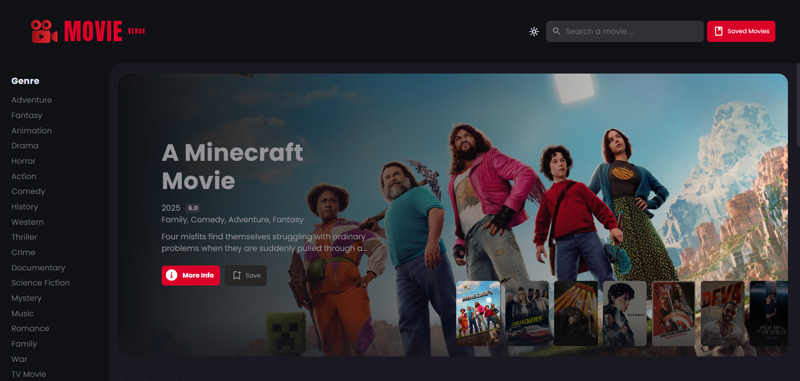

# MovieVerse



MovieVerse is a dynamic web application designed for movie enthusiasts. It leverages The Movie Database (TMDb) API to provide a rich, interactive experience for discovering and exploring movies and actors. Browse trending films, search for specific titles, delve into detailed movie information including cast and crew, and explore actor profiles with their complete filmographies.

## Features

- **Discover Movies:** Explore curated lists of popular, top-rated, and upcoming movies.
- **Advanced Search:** Find movies and actors quickly with a powerful search function.
- **Detailed Information:** Access comprehensive details for each movie, including synopsis, ratings, trailers, cast, crew, and related recommendations.
- **Actor Profiles:** View detailed actor biographies, photos, and a complete list of their movie credits.
- **Genre Filtering:** Browse movies by genre using the interactive sidebar.
- **Responsive Design:** Enjoy a seamless experience across desktops, tablets, and mobile devices.
- **(Optional) Theme Switching:** Easily switch between light and dark themes for optimal viewing comfort.

## Technologies Used

- HTML
- CSS
- JavaScript
- [The Movie Database (TMDb) API](https://www.themoviedb.org/documentation/api)

## Setup

1.  Clone the repository.
2.  Obtain a TMDb API key from [TMDb](https://www.themoviedb.org/settings/api).
3.  Create a `secret.js` file in the root directory and add your API key like this:
    ```javascript
    const API_KEY = 'YOUR_API_KEY';
    ```
4.  Open `index.html` in your web browser.

## Project Structure

```
├── index.html          # Main landing page
├── movie-list.html     # Page for listing movies (e.g., search results, genre lists)
├── detail.html         # Page for displaying movie details
├── actor-detail.html   # Page for displaying actor details
├── css/
│   └── style.css       # Main stylesheet
├── js/
│   ├── api.js          # Handles TMDb API calls
│   ├── global.js       # Global variables and utility functions
│   ├── index.js        # Logic for index.html
│   ├── movie-list.js   # Logic for movie-list.html
│   ├── detail.js       # Logic for detail.html
│   ├── actor-detail.js # Logic for actor-detail.html
│   ├── movie-card.js   # Creates movie card components
│   ├── search.js       # Handles search functionality
│   ├── sidebar.js      # Handles sidebar navigation/filtering
│   └── theme.js        # Handles theme switching (if applicable)
├── assets/             # Images, icons, and other static assets
├── secret.js           # Contains the TMDb API key (should be gitignored)
└── README.md           # This file
```
